# SimpleVideo: A Text and Image-to-Video Generation Platform

## ECE1724H Advanced Web Development Course Project Report

> Grouop members:
>  * Jijun Chi (1010253887) (chijijun@outlook.com)
>  * Winfred Tai (1004932683) (17zt12@queensu.ca)

## Video Demo
The live demo is available on [Google Drive](https://drive.google.com/file/d/1NZObxvTit1qqryh2VITzBbgcJ3lnxWmF/view?usp=drive_link).

## 1. Motivation
In today's digital content creation landscape, video has become the dominant medium for engagement across social media, marketing, and education. Video memes go virus easily on different platforms including X, YouTube, Instagram and BiliBili. However, creating high-quality, personalized video content remains a significant challenge for many users due to several reasons such as video editing technical barriers, time-intensive production processes and high cost of professional video creation.

While text-to-image generation has seen rapid adoption, text-and-image-to-video generation remains less accessible to everyday users despite recent technological advancements. Current solutions often require technical expertise, lack user-friendly interfaces, provide limited customization options or rely on a single text-to-video model, limiting quality and stylistic range
SimpleVideo addresses these challenges by creating an accessible platform targeting content creators in a wide range. Our solution aims to ease video creation by providing an intuitive interface with customizable options while integrating multiple AI services and practical content management features.

Our team deploy SimpleVideo on Vercel, along with tons of 3rd party tools. If you meet any issue when deploying this project to your own domain and website, please feel free to reach out to any of the team members and we're eager to help.

## 2. Objectives
Aiming to ease video creation and make it accessible to everyone regardless of technical background or resources the platform integrates video generation functionalities within a single, intuitive interface. By providing access to multiple external AI service providers, we enable flexible creative control and stylistic diversity while maintaining consistent quality. The main objective is to streamline the production workflow, enable personalized content at scale, implementate robust user management system with secure authentication, create a community for creation demonstration, and a dashboard where users can manage their generated content. 

## 3. Technical Stack
SimpleVideo utilizes a Next.js full-stack approach, we use React with TypeScript for type-checking safety and enhanced developer experience. Overall, the application is implemented with the App Router architecture. The frontend utilizes Tailwind CSS for styling with shadcn/ui components, which creates a responsive and modern interface. Prettier is used for uniform code format control. Backend functionality is implemented through Next.js API routes, which handle video generation requests and user data management. The video processing functionality is implemented through dedicated services, with separate routes for text-to-video and image-to-video generation. Cloudflare R2 Object Storage is utilized for file management which provides more scalable object storage. PostgreSQL via Supabase serves as the cloud storage solution. The database stores user data, video metadata (video file is stored in R2 bucket), and generation tasks. For authentication, the system integrates Supabase Auth with federated login support (Google OAuth), providing secure and convenient user access. Resend is connected to the supabase to send one time password(OTP) for user email login. Deployment is configured for Vercel with optimized build settings. Next-intl is employed to add the Internationalization and localization features. Additional technologies include integration with multiple external AI services for video generation which will be further discussed in the [API docmentation](https://github.com/winfredtai/ece1724w25/blob/main/SimpleVideo%20API%20Documentation.md).

## 4. Features

### Core features 
The platform will integrate with several external services as mentioned before:

**1. User Authentication System:** SimpleVideo implements Supabase Auth with multiple sign-in options including email/password, OTP, and Google OAuth 2.0. The system uses JWT for secure session management, enabling role-based access through claims. Resend connects with Supabase to deliver One-Time Passwords for email authentication, this method provides user with great convenience while maintaining the security.

**2. Interactive Video Generation Interface:** SimpleVideo features an intuitive interface built with React and TypeScript, styled using Tailwind CSS with shadcn/ui components. Users can easily navigate through the App Router architecture to access video generation tools, upload files with client-side validation, and preview compositions before processing.

**3. Multi-Provider AI Integration:** Next.js API routes create a flexible backend interface with multiple text-to-video AI services. Separate routes handle text-to-video and image-to-video generation. This abstraction layer standardizes interactions with diverse APIs from difference service providers, which provides optimal results for different styles while remaining the ability to quickly switch to better technologies. 

**4. Cloud Storage Integration:** The system also utilizes Cloudflare R2 for scalable object storage, where we can store the actual video files efficiently. PostgreSQL via Supabase handles only the structured data including user information, video metadata, and generation task information. This approach provides higher availability and cost-effective management with excellent performance characteristics.

### Course Requirements Fulfillment

This project fulfills course requirements by implementing:

1.Frontend Development:

- Next.js with React and TypeScript
- Modern UI with Tailwind CSS and shadcn/ui components
- Internationalization through next-intl

2. Backend Development:

- Next.js API routes for server-side functionality
- Authentication middleware and security best practices
- Dedicated video processing services

3. Database Design:

- PostgreSQL via Supabase for structured data
- Efficient schema design and indices for video metadata
- Optimized queries for performance

4. Cloud Integration:

- Vercel deployment with optimized build settings
- Cloudflare R2 for object storage
- Supabase for authentication and database services

5. Modern Development Practices:

- TypeScript for type safety
- Prettier for code formatting
- Responsive design principles

## 5. User Guide
### Register new account or using Google account for sign-in
The system provides a robust user authentication framework via Sucbase with an additional Google federated login for convenience. Users can choose Google Single Sign-On via the  "Login with Google" button or opt for email-based verification through the OTP system, which requires entering an email address and accquire the One-Time-Pass from their email address. A "Use Password Login" link provides traditional authentication for those who prefer it. Also there's an expandable "Other Login Methods" section, we only implemented the 3 ways of login as mentioned before.

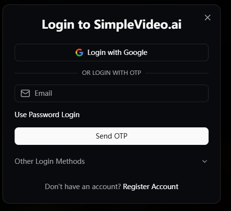

### English, Simplified Chinese and French
Since the potential users might use various languages, we implemented complete multi-language support using [next-intl](https://next-intl.dev/). Currently, there are 3 available languages: English, Simplified Chinese, and French. The language selector in the navigation bar allows users to switch between languages, resulting in a complete UI language transformation while maintaining all functionality. This ensures that users worldwide can comfortably navigate and use the platform in their preferred language. 

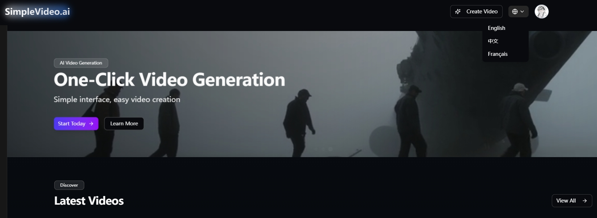
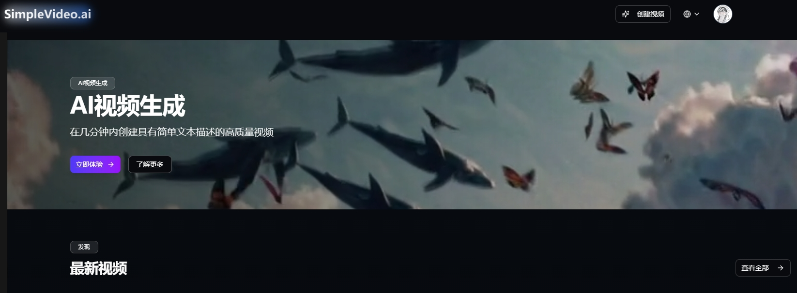
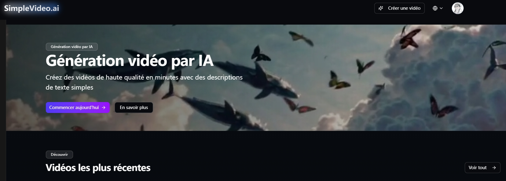

### Video Generation
SimpleVideo offers a comprehensive suite of AI-powered video generation capabilities through an intuitive interface based on external API integration. At its core, the platform integrates multiple text-to-video AI services (including Kling, Runway ML, and others) with customizable parameters for aspect ratio, quality, and duration. In total, there are around 10 external APIs, the system will decide which API to be used based on the incoming parameters.

#### Image to Video:
The Image to Video feature transforms static images into dynamic video content using AI technology. The interface provides an elegant, user-friendly workflow centered around a prominent upload area. Users begin by uploading an image to serve as the visual foundation, then craft a descriptive prompt that guides the AI in understanding the desired motion and scene development. This positive guidance tells the AI what to prioritize and emphasize when transforming your source image into moving content. For further refinement, user needs to input an optional negative prompt field where users can specify elements they wish to exclude from the generated vide (act as restrictions or boundaries). This combination allows for precise control over the video generation proces, for which the standard prompt pulls the generation toward desired elements while the negative prompt pushes it away from problematic ones. The user also needs to set Model quality and Video Duration. Once all parameters are configured user can acutally start to generate the video. 

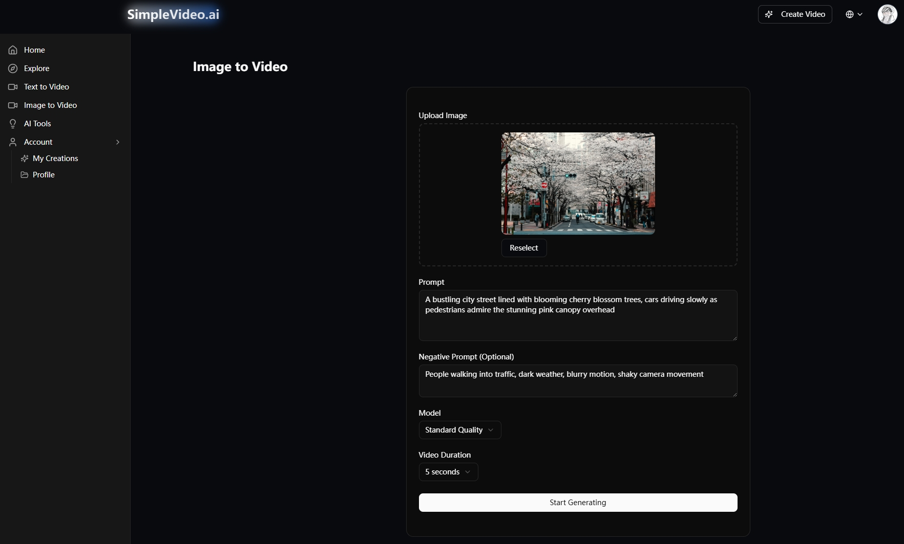

#### Text to Video:
Similar to image to video, the Text to Video feature allows users to create dynamic video content, but entirely from textual descriptions. Begin by selecting an AI model, the user then needs to input the positive and negative prompt taht follows the same style as mentioned in the previous section. Further customization includes through video quality selection (Standard or High Quality), duration options (5 or 10 seconds), and aspect ratio choices (1:1 Square, 16:9 Landscape, or 9:16 Portrait).

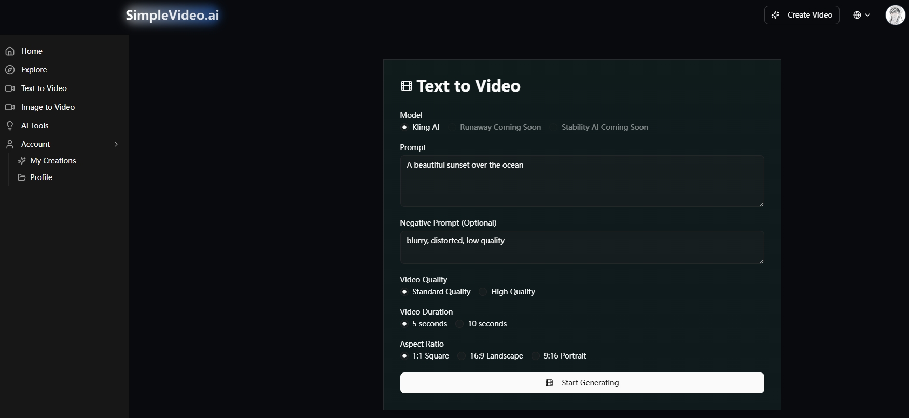

### Recurring cron jobs
The generation of video will take around a few minutes based on the user specified quality, duration and size, thus we set up a recurring job system with two PostgreSQL cron jobs to handle the process asynchronously. The first job checks video generation status every 30 seconds by querying external APIs, while the second job runs every 5 minutes to transfer completed videos from temporary URLs to permanent storage in Cloudflare R2. More details is discussed in the [API docmentation](https://github.com/winfredtai/ece1724w25/blob/main/SimpleVideo%20API%20Documentation.md).

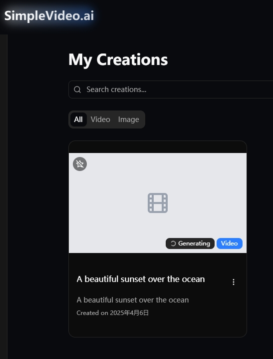

### User dashboard:
The User Dashboard provides a centralized hub for SimpleVideo.ai users to manage their account and content. The interface features a profile header with the user's details and buttons for profile editing and creating new videos. The multi-panel layout organizes functionality into sections such as Account Information, Credits, usage history, and purchase options; My Creations enables content management with filtering and sorting capabilities for all generated videos and images. Each content thumbnail includes creation details and action buttons for deletion, downloading, and sharing. The dashboard features Creation Statistics, tracking totals by content type and completion status, giving users insights into their platform usage.
Account Settings allow users to customize their experience through preference controls, notification management, and security options, including interface theme selection. All video content is stored in Cloudflare R2 cloud storage, which ensures access while maintaining performance. The credit-based system integrates with premium features like extended duration or enhanced quality.

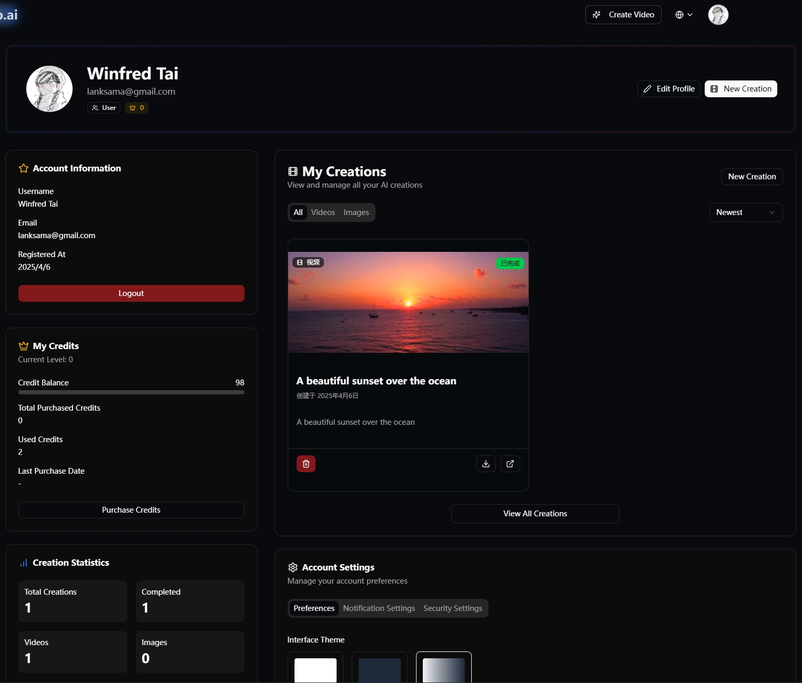

### User Creation 
The My Creations section provides users with a personalized library of all their generated content. This page allows users to quickly locate specific creations by entering keywords in the search bar, or through the filter based on type and date. 
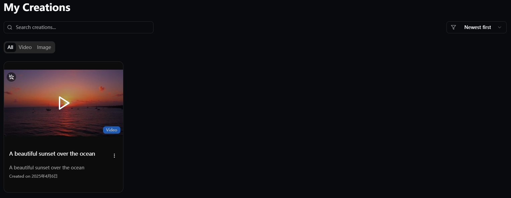

### Homepage
We also implement the homepage as the confluence page where where users can discover and explore content created by other users. All the videos here serve as a dynamic showcase of recently generated content from users across the platform. This section functions as a demonstration of platform capabilities while inspiring new users with practical applications.

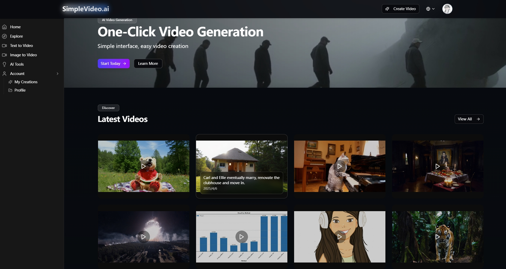

### Mobile and PC:
SimpleVideo's responsive interface is built with React, Next.js, and shadcn/ui components which ensures cross-environment compatibility tools and accessibility across devices (mobile and PC) while, it will automatically adapt to different screen sizes and orientations. On mobile devices, the interface maintains the same functionality while reorganizing elements to fit smaller screens.

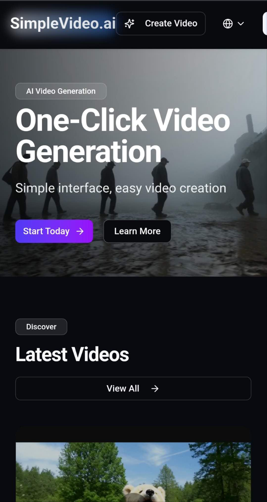

## 6. Development Guide

### Environment setup and configuration

1. Use pnpm version 10.
2. Run `pnpm install` to install dependencies.
3. Setup environment varaibles in `.env.example`.

### Generate supabase types.

1. Login to supabase: `pnpm exec supabase login`
2. Use `pnpm generate-types` to generate types in `src/types/supabase.ts`

### Build in local

1. Run `pnpm lint` to check type errors with `eslint`.
2. Run `pnpm build` and `pnpm start` to build the repo.

### Database initialization

We use Postgres with Supabase for data management. Please reference to initialization part in [API doc](https://github.com/winfredtai/ece1724w25/blob/main/SimpleVideo%20API%20Documentation.md).

### Cloud storage configuration

We're using Cloudflare R2 Ojbect Storage as the video and image storage. After receiving result urls from 3rd party provider, such as Kling, we run a cron task to scan the database and upload videos and images from the result url to R2 Object Storage. We limit the number of videos processed by one cron task to prevent being force killed by Supabase or Vercel.

### Local development and testing

1. Use `pnpm dev` to develop in local.
2. Open [http://localhost:3000](http://localhost:3000) with your browser to see the result.

## 7. Deployment Information
We deploy our project on Vercel, and setup a trigger connected to Github to build and deploy the main branch of the code after commits. Here's a full list of 3rd party services we use:
* Vercel
* Resend
* Supabase
* Google OAuth
* Cloudflare R2
* Kling AI
* 302.AI

## 8. Individual Contributions

Jijun Chi is responsible for:
* Build nextjs with App routes in Typescript, .
* Build `next-intl` middleware for multi-language support. Combine middlewares from `next-intl` and `Supabase`, enhancing error handling and default routing.
* Add all the front end pages, ui design.
* Backend API routes to handle video generation requests and create corresponding 3rd party task requests.
* Setup R2 Object Storage and connect to the repo.

Winfred Tai is responsible for:
* Setup Supabase configuration and initialize tables.
* Postgres database design and implementation.
* Setup user Authentication with Google OAuth and email One Time Password with Supabase and Resend.
* Setup Cron tasks to update video generation tasks and upload completed videos to R2 Object Storage.
* Write backend API routes to get user information and creations.

## 9. Lessons Learned and Concluding Remarks

* Start with small and simple. At the beginnging, we wanted to use a separated frontend-backend architecture, but soon we find the integrated full stack frameworks next.js are easy to use because of many plugin features from the community and 3rd party applications. Soon we re-desinged the system and decide to build the SimpleVideo upon Next.js.
* Embrace the community. We are astonished by the variety and richness of plugins and integrated features supported by the community. To be specific, `next-intl` integrates the i18n feature in one go and it provides a simple interface to translate keys to whatever language you want.
* Plan before coding. Clarifying requirements is vitally important for software development, especially for full stack development. Rushing to start coding caused us a lot of trouble, as we spent significant time trying to catch up with others after finishing our own parts. We also had to reproduce code generated by others because we hadn't reached an agreement on what APIs to provide and use beforehand.