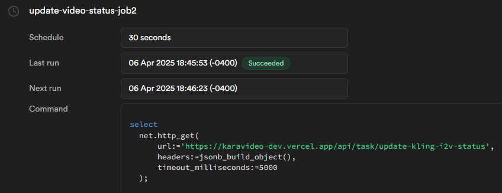
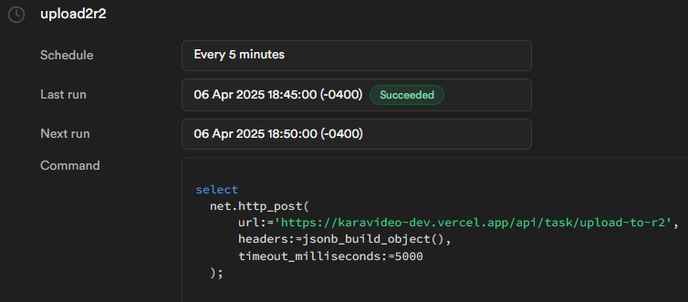

# SimpleVideo API Documentation

This document provides comprehensive documentation for the AI Video Generation API, which offers text-to-video and image-to-video generation capabilities using Kling AI models. As well as the Supabase DDL scripts we establish our database schema and automation for SimpleVideo's backend infrastructure.

## Table of Contents

1. [Authentication](#authentication)
2. [Video Generation APIs](#video-generation-apis)
   1. [Generate Standard 5s Video](#generate-standard-5s-video)
   2. [Generate Standard 10s Video](#generate-standard-10s-video)
   3. [Generate High-Quality 5s Video](#generate-high-quality-5s-video)
   4. [Generate High-Quality 10s Video](#generate-high-quality-10s-video)
   5. [Generate 5s Image-to-Video](#generate-5s-image-to-video)
   6. [Generate 10s Image-to-Video](#generate-10s-image-to-video)
   7. [Generate High-Quality 5s Image-to-Video](#generate-high-quality-5s-image-to-video)
   8. [Generate High-Quality 10s Image-to-Video](#generate-high-quality-10s-image-to-video)
   9. [Generate 5s Video (Official API)](#generate-5s-video-official-api)
3. [Task Management APIs](#task-management-apis)
   1. [Check Video Status](#check-video-status)
   2. [Update Kling Task Status](#update-kling-task-status)
   3. [Upload to R2 Storage](#upload-to-r2-storage)
4. [User-Related APIs](#user-related-apis)
   1. [Fetch User Creations](#fetch-user-creations)
   2. [Fetch User Credits](#fetch-user-credits)
   3. [Fetch User Subscription](#fetch-user-subscription)
5. [Public APIs](#public-apis)
   1. [Fetch Latest Videos](#fetch-latest-videos)
6. [Supabase Table DDL Scripts](#supabase-table-ddl-scripts)
   1. [Setup Tables Script](#setup-tables-script)
   2. [Update Admin Credits Script](#update-admin-credits-script)
   3. [Update 302 I2V Status Script](#update-302-i2v-status-script)
   4. [Fix RLS Policy Script](#fix-rls-policy-script)

## Authentication

Most endpoints require authentication. Authentication is handled through Supabase Auth, and the user's session is managed through cookies.

When a user is not authenticated, protected endpoints will return a 401 Unauthorized status code.

## Video Generation APIs

### Generate Standard 5s Video

Generates a standard 5-second video using the Kling AI model based on text prompts.

- **URL**: `/api/kling/5s`
- **Method**: `POST`
- **Auth Required**: Yes
- **Credits Required**: 1

#### Request Body

```json
{
  "prompt": "A beautiful sunset over the ocean",
  "negative_prompt": "blurry, distorted, low quality",
  "cfg": 0.3,
  "aspect_ratio": "1:1"
}
```

| Parameter | Type | Required | Description |
|-----------|------|----------|-------------|
| prompt | string | Yes | The text description of the video to generate |
| negative_prompt | string | No | Elements to avoid in the video (default: "") |
| cfg | number | No | Configuration scale for prompt adherence (default: 0.3) |
| aspect_ratio | string | No | Aspect ratio of the video (default: "1:1") |

#### Response

**Success (200 OK)**

```json
{
  "data": {
    "task": {
      "id": "task_12345abcde"
    }
  },
  "taskId": 123
}
```

**Error (401 Unauthorized)**

```json
{
  "error": "Unauthorized"
}
```

**Error (500 Internal Server Error)**

```json
{
  "error": "Failed to create task record"
}
```

### Generate Standard 10s Video

Generates a standard 10-second video using the Kling AI model based on text prompts.

- **URL**: `/api/kling/10s`
- **Method**: `POST`
- **Auth Required**: Yes
- **Credits Required**: 2

#### Request Body

Same as the 5s video endpoint.

#### Response

Same format as the 5s video endpoint.

### Generate High-Quality 5s Video

Generates a high-quality 5-second video using the Kling AI model based on text prompts.

- **URL**: `/api/kling/hq/5s`
- **Method**: `POST`
- **Auth Required**: Yes
- **Credits Required**: 2

#### Request Body

Same as the standard video endpoints.

#### Response

Same format as the standard video endpoints.

### Generate High-Quality 10s Video

Generates a high-quality 10-second video using the Kling AI model based on text prompts.

- **URL**: `/api/kling/hq/10s`
- **Method**: `POST`
- **Auth Required**: Yes
- **Credits Required**: 4

#### Request Body

Same as the standard video endpoints.

#### Response

Same format as the standard video endpoints.

### Generate 5s Image-to-Video

Converts an uploaded image into a 5-second video using the Kling AI model.

- **URL**: `/api/kling/i2v/5s`
- **Method**: `POST`
- **Auth Required**: Yes
- **Credits Required**: 2
- **Content-Type**: `multipart/form-data`

#### Request Body

```
input_image: [binary file data]
prompt: "A beautiful sunset over the ocean"
negative_prompt: "blurry, distorted, low quality"
cfg: 0.3
```

| Parameter | Type | Required | Description |
|-----------|------|----------|-------------|
| input_image | file | Yes | The image file to convert into a video |
| prompt | string | Yes | The text description to guide the video generation |
| negative_prompt | string | No | Elements to avoid in the video (default: "") |
| cfg | string/number | No | Configuration scale for prompt adherence (default: 0.3) |

#### Response

**Success (200 OK)**

```json
{
  "message": "任务创建成功",
  "taskId": 123,
  "statusId": 456,
  "status": "pending"
}
```

**Error (400 Bad Request)**

```json
{
  "error": "积分不足"
}
```

or

```json
{
  "error": "缺少必要参数"
}
```

**Error (401 Unauthorized)**

```json
{
  "error": "认证错误: Invalid user session"
}
```

**Error (500 Internal Server Error)**

```json
{
  "error": "创建任务记录失败: Database error",
  "details": {...}
}
```

### Generate 10s Image-to-Video

Converts an uploaded image into a 10-second video using the Kling AI model.

- **URL**: `/api/kling/i2v/10s`
- **Method**: `POST`
- **Auth Required**: Yes
- **Credits Required**: 3
- **Content-Type**: `multipart/form-data`

#### Request Body

Same as the 5s image-to-video endpoint.

#### Response

Same format as the 5s image-to-video endpoint.

### Generate High-Quality 5s Image-to-Video

Converts an uploaded image into a high-quality 5-second video using the Kling AI model.

- **URL**: `/api/kling/i2v/hq/5s`
- **Method**: `POST`
- **Auth Required**: Yes
- **Credits Required**: 4
- **Content-Type**: `multipart/form-data`

#### Request Body

Same as the standard image-to-video endpoints.

#### Response

Same format as the standard image-to-video endpoints.

### Generate High-Quality 10s Image-to-Video

Converts an uploaded image into a high-quality 10-second video using the Kling AI model.

- **URL**: `/api/kling/i2v/hq/10s`
- **Method**: `POST`
- **Auth Required**: Yes
- **Credits Required**: 6
- **Content-Type**: `multipart/form-data`

#### Request Body

Same as the standard image-to-video endpoints.

#### Response

Same format as the standard image-to-video endpoints.

### Generate 5s Video (Official API)

Creates a standard 5-second video using Kling AI's official API with JWT authentication.

- **URL**: `/api/kling-official/5s`
- **Method**: `POST`
- **Auth Required**: Yes
- **Credits Required**: 1

#### Request Body

```json
{
  "prompt": "A beautiful sunset over the ocean",
  "negative_prompt": "blurry, distorted, low quality",
  "cfg": 0.3,
  "aspect_ratio": "1:1",
  "camera_type": "simple",
  "camera_value": 1
}
```

| Parameter | Type | Required | Description |
|-----------|------|----------|-------------|
| prompt | string | Yes | The text description of the video to generate |
| negative_prompt | string | No | Elements to avoid in the video (default: "") |
| cfg | number | No | Configuration scale for prompt adherence (default: 0.3) |
| aspect_ratio | string | No | Aspect ratio of the video (default: "1:1") |
| camera_type | string | No | Type of camera movement (default: "simple") |
| camera_value | number | No | Camera movement intensity (default: 1) |

#### Response

**Success (200 OK)**

```json
{
  "data": {
    "task_id": "task_12345abcde"
  },
  "taskId": 123
}
```

**Error responses are similar to the other video generation endpoints.**

## Task Management APIs

### Check Video Status

Checks the status of pending and processing video generation tasks by querying an external API.

- **URL**: `/api/check-video-status`
- **Method**: `GET`
- **Auth Required**: No

#### Response

**Success (200 OK)**

```json
{
  "message": "Status check completed",
  "results": [
    {
      "taskId": 123,
      "success": true,
      "newStatus": "completed",
      "resultUrl": "https://example.com/videos/video123.mp4",
      "thumbnailUrl": "https://example.com/thumbnails/thumb123.jpg"
    },
    {
      "taskId": 124,
      "success": true,
      "newStatus": "processing"
    }
  ]
}
```

**Error (500 Internal Server Error)**

```json
{
  "error": "Error in status check: Database connection failed"
}
```

### Update Kling Task Status

Comprehensively checks and updates the status of pending and processing video generation tasks from both 302.ai and Kling's official API.

- **URL**: `/api/task/update-kling-i2v-status`
- **Method**: `GET`
- **Auth Required**: No

#### Response

**Success (200 OK)**

```json
{
  "success": true,
  "processed": 5,
  "updated": 3,
  "failed": 0,
  "duration_seconds": 0,
  "timestamp": "2023-06-01T12:34:56.789Z",
  "results": [
    {
      "taskId": 123,
      "success": true,
      "newStatus": "completed",
      "resultUrl": "https://example.com/videos/video123.mp4",
      "thumbnailUrl": "https://example.com/thumbnails/thumb123.jpg"
    }
  ]
}
```

**Error (500 Internal Server Error)**

```json
{
  "success": false,
  "error": "Database connection failed",
  "timestamp": "2023-06-01T12:34:56.789Z"
}
```

### Upload to R2 Storage

Uploads completed videos and thumbnails from external URLs to R2 storage.

- **URL**: `/api/task/upload-to-r2`
- **Method**: `POST`
- **Auth Required**: No

#### Request Body (Single Task Mode)

```json
{
  "taskId": 123,
  "userId": "user-uuid-12345",
  "videoUrl": "https://external.com/videos/video123.mp4",
  "thumbnailUrl": "https://external.com/thumbnails/thumb123.jpg"
}
```

| Parameter | Type | Required | Description |
|-----------|------|----------|-------------|
| taskId | number | Yes | The ID of the task to upload |
| userId | string | Yes | The user ID who owns the video |
| videoUrl | string | Yes | The external URL of the video to upload |
| thumbnailUrl | string | No | The external URL of the thumbnail to upload |

#### Request Body (Batch Mode)

No request body is needed for batch mode. The endpoint will automatically find and process tasks that need uploading.

#### Response (Single Task Mode)

**Success (200 OK)**

```json
{
  "success": true,
  "message": "Files uploaded to R2 successfully",
  "data": {
    "taskId": 123,
    "r2VideoUrl": "https://your-r2.com/videos/user-uuid-12345/123-video.mp4",
    "r2ThumbnailUrl": "https://your-r2.com/videos/user-uuid-12345/123-thumbnail.jpg"
  }
}
```

#### Response (Batch Mode)

**Success (200 OK)**

```json
{
  "success": true,
  "message": "Batch upload completed",
  "data": {
    "tasksProcessed": 3,
    "results": [
      {
        "taskId": 123,
        "success": true,
        "r2VideoUrl": "https://your-r2.com/videos/user1/123-video.mp4",
        "r2ThumbnailUrl": "https://your-r2.com/videos/user1/123-thumbnail.jpg"
      },
      {
        "taskId": 124,
        "success": false,
        "error": "Failed to download from external URL"
      }
    ]
  }
}
```

**Error (400 Bad Request)**

```json
{
  "error": "Missing required parameters"
}
```

**Error (404 Not Found)**

```json
{
  "error": "Task not found"
}
```

**Error (500 Internal Server Error)**

```json
{
  "error": "Upload failed: Connection refused",
  "details": {...}
}
```

## User-Related APIs

### Fetch User Creations

Retrieves all video generation tasks created by the authenticated user.

- **URL**: `/api/user/fetch-creation`
- **Method**: `GET`
- **Auth Required**: Yes

#### Response

**Success (200 OK)**

```json
{
  "creations": [
    {
      "id": 123,
      "user_id": "user-uuid-12345",
      "task_type": "video",
      "model": "kling",
      "high_quality": false,
      "prompt": "A beautiful sunset over the ocean",
      "negative_prompt": "blurry, distorted",
      "cfg": 0.3,
      "credits": 1,
      "created_at": "2023-06-01T12:34:56.789Z",
      "start_img_path": null,
      "additional_params": {
        "duration": "5s",
        "api_endpoint": "https://api.302.ai/klingai/m2v_16_txt2video_5s"
      },
      "status": "completed",
      "result_url": "https://your-r2.com/videos/user-uuid-12345/123-video.mp4",
      "thumbnail_url": "https://your-r2.com/videos/user-uuid-12345/123-thumbnail.jpg",
      "error_message": null
    }
  ]
}
```

**Error (401 Unauthorized)**

```json
{
  "error": "Unauthorized"
}
```

**Error (500 Internal Server Error)**

```json
{
  "error": "Failed to fetch creations"
}
```

### Fetch User Credits

Retrieves the credit balance and usage statistics for the authenticated user.

- **URL**: `/api/user/fetch-credit`
- **Method**: `GET`
- **Auth Required**: Yes

#### Response

**Success (200 OK)**

```json
{
  "user_id": "user-uuid-12345",
  "credits_balance": 50,
  "total_credits_purchased": 100,
  "total_credits_used": 50,
  "created_at": "2023-01-01T00:00:00.000Z",
  "updated_at": "2023-06-01T12:34:56.789Z"
}
```

**Error (401 Unauthorized)**

```json
{
  "error": "Unauthorized"
}
```

**Error (500 Internal Server Error)**

```json
{
  "error": "Failed to fetch credits"
}
```

### Fetch User Subscription

Retrieves the most recent subscription information for the authenticated user.

- **URL**: `/api/user/fetch-subscription`
- **Method**: `GET`
- **Auth Required**: Yes

#### Response

**Success (200 OK)**

```json
{
  "id": 123,
  "user_id": "user-uuid-12345",
  "plan_type": "premium",
  "status": "active",
  "start_date": "2023-01-01T00:00:00.000Z",
  "end_date": "2023-12-31T23:59:59.999Z",
  "renewal_status": "auto",
  "created_at": "2023-01-01T00:00:00.000Z",
  "updated_at": "2023-01-01T00:00:00.000Z"
}
```

**Error (401 Unauthorized)**

```json
{
  "error": "Unauthorized"
}
```

**Error (500 Internal Server Error)**

```json
{
  "error": "Failed to fetch subscription"
}
```

## Public APIs

### Fetch Latest Videos

Retrieves the 5 most recently completed videos across all users.

- **URL**: `/api/videos/latest`
- **Method**: `GET`
- **Auth Required**: No

#### Response

**Success (200 OK)**

```json
[
  {
    "id": "123",
    "videoUrl": "https://your-r2.com/videos/user1/123-video.mp4",
    "created_at": "2023-06-01T12:34:56.789Z",
    "title": "A beautiful sunset over the ocean"
  },
  {
    "id": "124",
    "videoUrl": "https://your-r2.com/videos/user2/124-video.mp4",
    "created_at": "2023-06-01T10:30:00.000Z",
    "title": "Majestic mountains with snow capped peaks"
  }
]
```

**Error (500 Internal Server Error)**

```json
{
  "error": "获取视频失败"
}
```

## Supabase Table DDL Scripts

The following scripts establish our database schema and automation for SimpleVideo's backend infrastructure. All scripts are included in our source code repository at `repo\sql`.

### Setup Tables Script

This is the initial database setup script that creates all core tables (user_credits, video_generation_task_definitions, video_generation_task_statuses, user_favorites, user_subscriptions) with proper constraints and indexes. It also enables Row Level Security (RLS) with detailed policies to control data access based on user authentication. The script creates specific policies for different operations (SELECT, INSERT, UPDATE) and different user roles (authenticated users vs service role). It includes a function to safely retrieve user credit information with elevated privileges.

```sql
-- Enable RLS
ALTER DATABASE postgres SET "app.jwt_secret" TO '1anaTzRWQlIrUQobn8YTFFC+ArQnIS06LAYozyO9L0LuC4jjlLAOP2KBUZGSBGMvWewbkTtf6SBPWeGqwiohiA==';

-- Create tables
CREATE TABLE IF NOT EXISTS user_credits (
    id BIGSERIAL PRIMARY KEY,
    user_id UUID NOT NULL REFERENCES auth.users(id) ON DELETE CASCADE,
    credits_balance INTEGER NOT NULL DEFAULT 0,
    total_credits_purchased INTEGER NOT NULL DEFAULT 0,
    total_credits_used INTEGER NOT NULL DEFAULT 0,
    level VARCHAR(50) NOT NULL DEFAULT 'free',
    last_purchase_date TIMESTAMP WITH TIME ZONE,
    created_at TIMESTAMP WITH TIME ZONE DEFAULT TIMEZONE('utc'::text, NOW()) NOT NULL,
    updated_at TIMESTAMP WITH TIME ZONE DEFAULT TIMEZONE('utc'::text, NOW()) NOT NULL,
    UNIQUE(user_id)
);

CREATE TABLE IF NOT EXISTS video_generation_task_definitions (
    id BIGSERIAL PRIMARY KEY,
    user_id UUID REFERENCES auth.users(id) ON DELETE SET NULL,
    task_type VARCHAR(50) NOT NULL,
    model VARCHAR(50) NOT NULL,
    prompt TEXT,
    negative_prompt TEXT,
    start_img_path TEXT NOT NULL,
    end_img_path TEXT,
    aspect_ratio VARCHAR(20),
    camera_type VARCHAR(50),
    camera_value TEXT,
    cfg NUMERIC,
    high_quality BOOLEAN NOT NULL DEFAULT false,
    credits INTEGER NOT NULL,
    additional_params JSONB,
    created_at TIMESTAMP WITH TIME ZONE DEFAULT TIMEZONE('utc'::text, NOW()) NOT NULL
);

CREATE TABLE IF NOT EXISTS video_generation_task_statuses (
    id BIGSERIAL PRIMARY KEY,
    task_id BIGINT NOT NULL REFERENCES video_generation_task_definitions(id) ON DELETE CASCADE,
    status VARCHAR(50) NOT NULL DEFAULT 'pending',
    external_task_id TEXT,
    result_url TEXT,
    thumbnail_url TEXT,
    error_message TEXT,
    created_at TIMESTAMP WITH TIME ZONE DEFAULT TIMEZONE('utc'::text, NOW()) NOT NULL,
    updated_at TIMESTAMP WITH TIME ZONE DEFAULT TIMEZONE('utc'::text, NOW()) NOT NULL
);

CREATE TABLE IF NOT EXISTS user_favorites (
    id BIGSERIAL PRIMARY KEY,
    user_id UUID NOT NULL REFERENCES auth.users(id) ON DELETE CASCADE,
    task_id BIGINT NOT NULL REFERENCES video_generation_task_definitions(id) ON DELETE CASCADE,
    created_at TIMESTAMP WITH TIME ZONE DEFAULT TIMEZONE('utc'::text, NOW()) NOT NULL,
    updated_at TIMESTAMP WITH TIME ZONE DEFAULT TIMEZONE('utc'::text, NOW()) NOT NULL,
    UNIQUE(user_id, task_id)
);

CREATE TABLE IF NOT EXISTS user_subscriptions (
    id BIGSERIAL PRIMARY KEY,
    user_id UUID NOT NULL REFERENCES auth.users(id) ON DELETE CASCADE,
    plan_type VARCHAR(50) NOT NULL,
    status VARCHAR(50) NOT NULL,
    credits_per_period INTEGER NOT NULL,
    start_date TIMESTAMP WITH TIME ZONE NOT NULL,
    end_date TIMESTAMP WITH TIME ZONE NOT NULL,
    next_renewal_date TIMESTAMP WITH TIME ZONE NOT NULL,
    subscription_interval VARCHAR(50),
    auto_renew BOOLEAN NOT NULL DEFAULT true,
    payment_method VARCHAR(50),
    price_paid NUMERIC,
    cancellation_date TIMESTAMP WITH TIME ZONE,
    created_at TIMESTAMP WITH TIME ZONE DEFAULT TIMEZONE('utc'::text, NOW()) NOT NULL,
    updated_at TIMESTAMP WITH TIME ZONE DEFAULT TIMEZONE('utc'::text, NOW()) NOT NULL
);

-- Create indexes
CREATE INDEX IF NOT EXISTS idx_user_credits_user_id ON user_credits(user_id);
CREATE INDEX IF NOT EXISTS idx_task_definitions_user_id ON video_generation_task_definitions(user_id);
CREATE INDEX IF NOT EXISTS idx_task_statuses_task_id ON video_generation_task_statuses(task_id);
CREATE INDEX IF NOT EXISTS idx_task_statuses_status ON video_generation_task_statuses(status);
CREATE INDEX IF NOT EXISTS idx_user_favorites_user_id ON user_favorites(user_id);
CREATE INDEX IF NOT EXISTS idx_user_favorites_task_id ON user_favorites(task_id);
CREATE INDEX IF NOT EXISTS idx_user_subscriptions_user_id ON user_subscriptions(user_id);
CREATE INDEX IF NOT EXISTS idx_user_subscriptions_status ON user_subscriptions(status);

-- Enable Row Level Security (RLS)
ALTER TABLE user_credits ENABLE ROW LEVEL SECURITY;
ALTER TABLE video_generation_task_definitions ENABLE ROW LEVEL SECURITY;
ALTER TABLE video_generation_task_statuses ENABLE ROW LEVEL SECURITY;
ALTER TABLE user_favorites ENABLE ROW LEVEL SECURITY;
ALTER TABLE user_subscriptions ENABLE ROW LEVEL SECURITY;

-- Create RLS Policies
-- user_credits policies
CREATE POLICY "Users can view their own credits"
    ON user_credits FOR SELECT
    USING (auth.uid() = user_id);

CREATE POLICY "Service role can manage all credits"
    ON user_credits FOR ALL
    USING (auth.jwt()->>'role' = 'service_role');

-- video_generation_task_definitions policies
CREATE POLICY "Users can view their own tasks and public tasks"
    ON video_generation_task_definitions FOR SELECT
    USING (auth.uid() = user_id OR user_id IS NULL);

CREATE POLICY "Users can create their own tasks"
    ON video_generation_task_definitions FOR INSERT
    WITH CHECK (auth.uid() = user_id);

CREATE POLICY "Users can update their own tasks"
    ON video_generation_task_definitions FOR UPDATE
    USING (auth.uid() = user_id);

-- video_generation_task_statuses policies
CREATE POLICY "Users can view statuses of their tasks"
    ON video_generation_task_statuses FOR SELECT
    USING (EXISTS (
        SELECT 1 FROM video_generation_task_definitions
        WHERE id = video_generation_task_statuses.task_id
        AND (user_id = auth.uid() OR user_id IS NULL)
    ));

CREATE POLICY "Service role can manage all task statuses"
    ON video_generation_task_statuses FOR ALL
    USING (auth.jwt()->>'role' = 'service_role');

-- user_favorites policies
CREATE POLICY "Users can manage their own favorites"
    ON user_favorites FOR ALL
    USING (auth.uid() = user_id);

-- user_subscriptions policies
CREATE POLICY "Users can view their own subscriptions"
    ON user_subscriptions FOR SELECT
    USING (auth.uid() = user_id);

CREATE POLICY "Service role can manage all subscriptions"
    ON user_subscriptions FOR ALL
    USING (auth.jwt()->>'role' = 'service_role');

-- Create function to get user credits
CREATE OR REPLACE FUNCTION get_user_credits(user_id_param UUID)
RETURNS TABLE (
    user_id UUID,
    credits_balance INTEGER,
    total_credits_purchased INTEGER,
    total_credits_used INTEGER,
    level VARCHAR,
    last_purchase_date TIMESTAMP WITH TIME ZONE,
    created_at TIMESTAMP WITH TIME ZONE,
    updated_at TIMESTAMP WITH TIME ZONE
) SECURITY DEFINER
AS $$
BEGIN
    RETURN QUERY
    SELECT 
        uc.user_id,
        uc.credits_balance,
        uc.total_credits_purchased,
        uc.total_credits_used,
        uc.level,
        uc.last_purchase_date,
        uc.created_at,
        uc.updated_at
    FROM user_credits uc
    WHERE uc.user_id = user_id_param;
END;
$$ LANGUAGE plpgsql;
```

### Update Admin Credits Script

This targeted script either inserts or updates credits for the specific admin user (with UUID 917df06a-071f-41e4-88b0-e352912430da on our Supabase deployment). It sets the level to 'admin', credits balance to 100,000, and accumulates total purchased credits. This script is used to provision privileged accounts with sufficient resources to test or administer the system.

```sql
INSERT INTO public.user_credits (level, user_id, credits_balance, total_credits_purchased, total_credits_used) 
VALUES ('admin', '917df06a-071f-41e4-88b0-e352912430da', 100000, 100000, 0) 
ON CONFLICT (user_id) 
DO UPDATE SET 
  level = 'admin', 
  credits_balance = 100000, 
  total_credits_purchased = EXCLUDED.total_credits_purchased + public.user_credits.total_credits_purchased, 
  updated_at = NOW();
```

### Update 302 I2V Status Script

This PostgreSQL stored procedure processes pending image-to-video generation tasks by querying the 302.ai API. The function fetches tasks with pending/processing status, makes HTTP requests to check their progress, and updates the database accordingly. It includes error handling, timeout detection, status mapping logic, and fallback strategies when API calls fail. The function is designed to be executed periodically via a cron job.

Two Supabase Cron scheduled recurring jobs are configured:

1. **update-video-status-job2**: Runs every 30 seconds and makes HTTP GET requests to the Next.js API endpoint at "/api/task/update-kling-i2v-status". This endpoint communicates with both the official Kling API and the 302.ai API to fetch video generation task status.


2. **upload2r2**: Runs every 5 minutes and calls the "/api/task/upload-to-r2" endpoint. This job identifies completed video generation tasks that haven't yet been transferred to permanent storage, downloads the files from temporary URLs, uploads them to Cloudflare R2 storage, and updates database records with the new permanent URLs.


### Fix RLS Policy Script

A maintenance script that corrects Row Level Security policies. It drops potentially problematic existing policies and creates refined ones for video generation tables. The script ensures authenticated users can only access their own data while giving service_role accounts full access. It also grants the necessary database permissions required for cron jobs to function correctly when accessing these tables.

```sql
-- 为video_generation_task_definitions表启用RLS
ALTER TABLE video_generation_task_definitions ENABLE ROW LEVEL SECURITY;

-- 删除可能存在的旧策略
DROP POLICY IF EXISTS "用户可以创建自己的视频任务" ON video_generation_task_definitions;
DROP POLICY IF EXISTS "用户可以查看自己的视频任务" ON video_generation_task_definitions;

-- 创建正确的RLS策略
CREATE POLICY "用户可以创建自己的视频任务" 
ON video_generation_task_definitions 
FOR INSERT
TO authenticated
WITH CHECK (auth.uid() = user_id);

CREATE POLICY "用户可以查看自己的视频任务" 
ON video_generation_task_definitions 
FOR SELECT
TO authenticated
USING (auth.uid() = user_id);

-- 为video_generation_task_statuses表启用RLS
ALTER TABLE video_generation_task_statuses ENABLE ROW LEVEL SECURITY;

-- 删除可能存在的旧策略
DROP POLICY IF EXISTS "Users can insert their task statuses" ON video_generation_task_statuses;
DROP POLICY IF EXISTS "Users can view their task statuses" ON video_generation_task_statuses;
DROP POLICY IF EXISTS "Service role can access all task statuses" ON video_generation_task_statuses;

-- 创建新的策略
CREATE POLICY "Users can insert task statuses" 
ON video_generation_task_statuses 
FOR INSERT
TO authenticated
WITH CHECK (EXISTS (
  SELECT 1 
  FROM video_generation_task_definitions 
  WHERE id = task_id 
  AND user_i